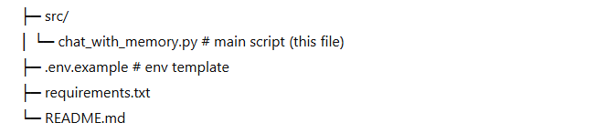

README.md (copy-paste this)
# 🗣️ LangChain Conversational AI with Memory (Runnable + BufferMemory)

A minimal, production-ready example of a **conversational AI** built with **LangChain** and **OpenAI GPT-4o-mini** that:
- Maintains **conversation context** using `ConversationBufferMemory`
- Uses **Runnable** compositions (`RunnableParallel`, `RunnablePassthrough`)
- Supports both a **custom chain** and a **drop-in ConversationChain**

------------------------------------

## ✨ Features

- **Memory-aware replies:** The assistant remembers prior turns via `ConversationBufferMemory`.
- **Composable chains:** Prompting and inference are wired with `Runnable*` for clarity and reuse.
- **Dual usage:** Shows both a custom runnable pipeline **and** `ConversationChain`.
- **Environment-safe:** Loads `OPENAI_API_KEY` from `.env` or prompts securely.

------------------------------------

## 🧱 Project Structure

Create a `.env` file in the repo root:

OPENAI_API_KEY=your_openai_api_key_here

Or the script will securely prompt you once at runtime.

------------------------------------

## 🧰 Requirements

- Python 3.10+
- Packages:
  - `langchain`
  - `langchain-openai`
  - `python-dotenv`
  - `openai`  *(transitive for some setups, included for safety)*

Install:

pip install -r requirements.txt

requirements.txt

langchain
langchain-openai
python-dotenv
openai

------------------------------------

🚀 Run
python src/chat_with_memory.py

You should see three memory-aware answers, then a final reply from ConversationChain.

------------------------------------

🧪 Sample session
User: What is LangChain?
AI: LangChain is a framework for building LLM applications with composable components...

User: How does it use memory?
AI: In this example we use ConversationBufferMemory to store prior messages...

User: Can you summarize what we talked about?
AI: We discussed what LangChain is and how memory is used to retain context...

------------------------------------

🧩 Also shown: ConversationChain

The script includes a standard ConversationChain usage:

conversation = ConversationChain(llm=llm, memory=memory)
response = conversation.predict(input="What did I just ask?")
print("AI:", response)

This demonstrates the higher-level, batteries-included approach.

------------------------------------

🛡️ Notes & Tips

Memory growth: ConversationBufferMemory stores the full transcript.
For long chats, consider ConversationBufferWindowMemory or token-based summarization.

Determinism: For more stable outputs, reduce temperature (e.g., 0.2).

Extensibility: Swap in ChatPromptTemplate variants or add tools/routings later.